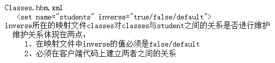

# cascade 、inverse详解
>` cascade`有以下四种值：
`all`: 所有情况下均进行关联操作。
`none`: 所有情况下均不进行关联操作。这是默认值。
`save-update`: 在执行save/update/saveOrUpdate时进行关联操作。
`delete`: 在执行delete时进行关联操作。

>  `inverse`
    `
> 详情请点：[cascade 、inverse详解 ](http://blog.sina.com.cn/s/blog_7ffb8dd50101450c.html)


# 一对多（多对一）
`班级`
``` xml
<?xml version="1.0" encoding="utf-8"?>
<!DOCTYPE hibernate-mapping PUBLIC "-//Hibernate/Hibernate Mapping DTD 3.0//EN"
"http://hibernate.sourceforge.net/hibernate-mapping-3.0.dtd">
<hibernate-mapping>
	<class name="cn.itcast.hiberate.sh.domain.Classes">
		<id name="cid" length="5" type="java.lang.Long">
			<generator class="increment"></generator>
		</id>
		<property name="cname" length="20" type="java.lang.String"></property>
		
		<property name="description" length="100" type="java.lang.String"></property>
		<!-- 
			set元素对应类中的set集合
			通过set元素使classes表与student表建立关联
			   key是通过外键的形式让两张表建立关联
			   one-to-many是通过类的形式让两个类建立关联
			
			cascade 级联
			   save-update
			   	1、当 保存班级的时候，对学生进行怎么样的操作
			   	     如果学生对象在数据库中没有对应的值，这个时候会执行save操作
			   	     如果学生对象在数据库中有对应的值，这个时候会执行update操作
			   delete
			   all
			inverse  维护关系
			   true      不维护关系     
			   false     维护关系
			   default   false
		 -->
		<set name="students" cascade="all" inverse="true">
			<!-- 
				key是用来描述外键
			 -->
			<key>
				<column name="cid"></column>
			</key>
			<one-to-many class="cn.itcast.hiberate.sh.domain.Student"/>
		</set>
	</class>
</hibernate-mapping>
```
`学生`
``` xml
<?xml version="1.0" encoding="utf-8"?>
<!DOCTYPE hibernate-mapping PUBLIC "-//Hibernate/Hibernate Mapping DTD 3.0//EN"
"http://hibernate.sourceforge.net/hibernate-mapping-3.0.dtd">
<hibernate-mapping>
	<class name="cn.itcast.hiberate.sh.domain.Student">
		<id name="sid" length="5">
			<generator class="increment"></generator>
		</id>
		<property name="sname" length="20"></property>
		<property name="description" length="100"></property>
	</class>
</hibernate-mapping>
```
# 多对多
多对多关系也很常见，例如学生与选修课之间的关系，一个学生可以选择多门选修课，而每个选修课又可以被多名学生选择。`数据库`中的多对多关联关系一般需采用中间表的方式处理，将多对多转化为两个一对多。
`学生：`
``` xml
<?xml version="1.0" encoding="utf-8"?>
<!DOCTYPE hibernate-mapping PUBLIC "-//Hibernate/Hibernate Mapping DTD 3.0//EN" "http://hibernate.sourceforge.net/hibernate-mapping-3.0.dtd">
<hibernate-mapping>
    <class name="com.suxiaolei.hibernate.pojos.Student" table="student">
        <id name="id" type="integer">
            <column name="id"></column>
            <generator class="increment"></generator>
        </id>

        <property name="name" column="name" type="string"></property>

        <set name="courses" inverse="false" cascade="save-update" table="student_course">
            <key column="student_id"></key>
            <many-to-many class="com.suxiaolei.hibernate.pojos.Course"
                column="course_id"></many-to-many>
        </set>
    </class>
</hibernate-mapping>
```
`课程：`
``` xml
<?xml version="1.0" encoding="utf-8"?>
<!DOCTYPE hibernate-mapping PUBLIC "-//Hibernate/Hibernate Mapping DTD 3.0//EN" "http://hibernate.sourceforge.net/hibernate-mapping-3.0.dtd">
<hibernate-mapping>
    <class name="com.suxiaolei.hibernate.pojos.Course" table="course">
        <id name="id" type="integer">
            <column name="id"></column>
            <generator class="increment"></generator>
        </id>

        <property name="name" column="name" type="string"></property>

        <set name="students" inverse="true" cascade="save-update" table="student_course">
            <key column="course_id"></key>
            <many-to-many class="com.suxiaolei.hibernate.pojos.Student"
                column="student_id"></many-to-many>
        </set>
    </class>
</hibernate-mapping>
```
# 一对一
> 一对一关系就球队与球队所在地之间的关系，一支球队仅有一个地址，而一个地区也仅有一支球队（貌似有点勉强，将就下吧）。数据表间一对一关系的表现有两种，一种是外键关联，一种是主键关联。图示如下：

## 一对一外键关联：
`地址：`
``` xml
<?xml version="1.0" encoding="utf-8"?>
<!DOCTYPE hibernate-mapping PUBLIC "-//Hibernate/Hibernate Mapping DTD 3.0//EN" "http://hibernate.sourceforge.net/hibernate-mapping-3.0.dtd">
<hibernate-mapping>
    <class name="com.suxiaolei.hibernate.pojos.Adress" table="adress">
        <id name="id" type="integer">
            <column name="id"></column>
            <generator class="increment"></generator>
        </id>

        <property name="city" column="city" type="string"></property>
        
        <one-to-one name="team" class="com.suxiaolei.hibernate.pojos.Team" cascade="all"></one-to-one>

    </class>
</hibernate-mapping>
```
`球队：`
``` xml
<?xml version="1.0" encoding="utf-8"?>
<!DOCTYPE hibernate-mapping PUBLIC "-//Hibernate/Hibernate Mapping DTD 3.0//EN" "http://hibernate.sourceforge.net/hibernate-mapping-3.0.dtd">
<hibernate-mapping>
    <class name="com.suxiaolei.hibernate.pojos.Team" table="team">
        <id name="id" type="integer">
            <column name="id"></column>
            <generator class="increment"></generator>
        </id>

        <property name="name" column="name" type="string"></property>
        
        <many-to-one name="adress" class="com.suxiaolei.hibernate.pojos.Adress" column="adress_id" unique="true"></many-to-one>

    </class>
</hibernate-mapping>
```
> 一对一外键关联，其实可以看做是一对多的一种特殊形式，多方退化成一。多方退化成一只需要在<many-to-one>标签中设置"unique"="true"。


## 一对一主键关联在hbm文件中的配置信息：

`地址`:
``` xml
<hibernate-mapping>
    <class name="com.suxiaolei.hibernate.pojos.Adress" table="adress">
        <id name="id" type="integer">
            <column name="id"></column>
            <generator class="increment"></generator>
        </id>

        <property name="city" column="city" type="string"></property>
        
        <one-to-one name="team" class="com.suxiaolei.hibernate.pojos.Team" cascade="all"></one-to-one>

    </class>
</hibernate-mapping>
```
`球队`:
``` xml
<hibernate-mapping>
    <class name="com.suxiaolei.hibernate.pojos.Team" table="team">
        <id name="id" type="integer">
            <column name="id"></column>
            <generator class="foreign">
                <param name="property">adress</param>
            </generator>
        </id>

        <property name="name" column="name" type="string"></property>
        
        <one-to-one name="adress" class="com.suxiaolei.hibernate.pojos.Adress" cascade="all"></one-to-one>

    </class>
</hibernate-mapping>
```
> 一对一主键关联，是让两张的主键值一样。要使两表的主键相同，只能一张表生成主键，另一张表参考主键。

``` xml
<generator class="foreign">
　　<param name="property">adress</param>
</generator>
```
`"class"="foreign"`就是设置team表的主键参照adress属性的主键值。

# 详情请看
[Hibernate关联关系配置](http://blog.csdn.net/xrt95050/article/details/7322222)