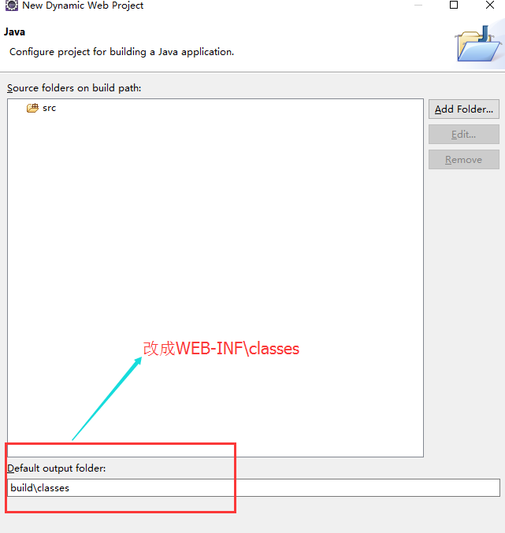

# 错误提示
> 报以下错误:

``` java
There is no Action mapped for namespace [/] and action name [test] associated with context path [/test]. - [unknown location] 
```

# 解决方案
1. 确保`struts.xml`文件名大小写正确：struts.xml
2. 确保struts.xml文件在`src`目录下,**编译成功后，要确认是否编译到classes目录中**项目右键 ->properties ->Java Build Path ->source ->Default output folder，选择你的路径。(`也可以在新建项目时选择,如图：`)
3. 先排查访问的链接有没有问题（细节问题）
4. 查看struts.xml的配置（仔细排查，出现问题几率很大）
5. 查看结果响应页面是否存在问题（出现问题的几率比较小）

> 如果上面的四个步骤没出问题，可是还是报错，怎么办？
> 在`struts2.5.2`中添加如下配置`<constant name="struts.enable.DynamicMethodInvocation" value="false" />`
- 当使用动态调用方法时（action名 + 感叹号 + 方法名进行方法调用），需要将其属性改为`true`，
- 当使用通配符调用语法时，建议将其属性改为false（struts2.5.2中默认是`false`）

> 但在struts2.5.5中不行了，没错，博主用的就是2.5.5的，花了我一下午，心累。改法如下
``` xml
<!--这一句必须添加-->
<constant name="struts.enable.DynamicMethodInvocation" value="false" />
<package name="test" namespace="/test" extends="struts-default">
		<action name="test_*" class="test.controller.TestAction"
			method="{1}">
			<result name="success">/index.jsp</result>
			<!--还有这一句，success为TestAction中的方法名-->
			<allowed-methods>success</allowed-methods>
		</action>
	</package>
```
> `说明:`在struts2.3之前的版本，正常的配置就可以了，但在struts2.3版本之后，使用通配符调用方法时，内部会验证是否允许访问该方法，所以要加上
`用法如下:`
``` xml
<allowed-methods>方法名1，方法名2…</allowed-methods>
```

> `struts.xml配置：`
``` xml
<struts>  
    <!-- 指定默认编码集 -->  
    <constant name="struts.i18n.encoding" value="UTF-8"></constant>  
    <!-- 指定需要Struts2处理的请求后缀 -->  
    <constant name="struts.action.extension" value="do,action"></constant>  
    <!-- 设置浏览器是否缓存静态内容，开发阶段应关闭，生产阶段打开，默认为打开 -->  
    <constant name="struts.serve.static.browserCache" value="false"></constant>  
    <!-- 当struts的配置文件修改后，系统是否自动重新加载该文件，默认为false，开发阶段应打开 -->  
    <constant name="struts.configuration.xml.reload" value="true"></constant>  
    <!-- 开发模式下使用，可以打印出更详细的错误信息 -->  
    <constant name="struts.devMode" value="true"></constant>  
    <!-- action全部用注解进行配置 -->  
  
    <!-- 是否开启动态方法调用 -->  
    <constant name="struts.enable.DynamicMethodInvocation" value="false" />  
    <!--添加包 -->  
     <package name="weibo" extends="struts-default" namespace="/">
        <action name="weibo_*" class="hhh.controller.WeiboAction" method="{1}">
            <result name="toIndex">/index.jsp</result>
            <result name="publish">/WEB-INF/jsp/publish.jsp</result>
            <result name="toList">/WEB-INF/jsp/list.jsp</result>
            <allowed-methods>success,publishUI,listAirticle,publish</allowed-methods>
        </action>
    </package>
</struts>
```
# 原文参考
[struts2.5框架使用通配符指定方法（常见错误）](http://www.cnblogs.com/gsy52300/p/5778754.html)
[ eclipse下简单配置struts2.5.8 ](http://blog.csdn.net/leafage_m/article/details/54343580)