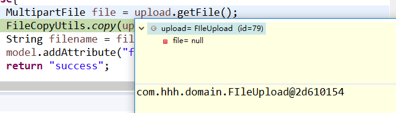

# SpringMVC文件上传
这里直接上代码：
- upload-servlet.xml
``` java
<?xml version="1.0" encoding="UTF-8"?>
<beans xmlns="http://www.springframework.org/schema/beans"
   xmlns:context="http://www.springframework.org/schema/context"
   xmlns:xsi="http://www.w3.org/2001/XMLSchema-instance"
   xsi:schemaLocation="
   http://www.springframework.org/schema/beans    
   http://www.springframework.org/schema/beans/spring-beans-3.0.xsd
   http://www.springframework.org/schema/context 
   http://www.springframework.org/schema/context/spring-context-3.0.xsd">

   <context:component-scan base-package="com.hhh" />

   <bean class="org.springframework.web.servlet.view.InternalResourceViewResolver">
      <property name="prefix" value="/WEB-INF/jsp/" />
      <property name="suffix" value=".jsp" />
   </bean>
   
   <bean id="multipartResolver" class="org.springframework.web.multipart.commons.CommonsMultipartResolver">
   
   </bean>
   

</beans>
```
> `CommonsMultipartResolver`文件上传所需的类，如若删去，会报如下错:

``` java
java.lang.NullPointerException
```
定位到这一段:
``` java
FileCopyUtils.copy(upload.getFile().getBytes(), new File(storePath+"\\"+file.getOriginalFilename()));
```
debug调试可知，前端文件传不进来:

- FileUploadController.java
``` java
package com.hhh.controller;

import java.io.File;
import java.io.IOException;

import javax.servlet.ServletContext;

import org.springframework.beans.factory.annotation.Autowired;
import org.springframework.stereotype.Controller;
import org.springframework.ui.ModelMap;
import org.springframework.util.FileCopyUtils;
import org.springframework.validation.BindingResult;
import org.springframework.validation.annotation.Validated;
import org.springframework.web.bind.annotation.RequestMapping;
import org.springframework.web.bind.annotation.RequestMethod;
import org.springframework.web.multipart.MultipartFile;
import org.springframework.web.servlet.ModelAndView;

import com.hhh.domain.FIleUpload;

@Controller
public class FileUploadController {
	
	@Autowired
	ServletContext context;
	
	@RequestMapping(value="/fileupload",method=RequestMethod.GET)
	public ModelAndView fileUpload(){
		return new ModelAndView("fileupload","command",new FIleUpload());
	}
	
	@RequestMapping(value="/success",method=RequestMethod.POST)
	public String fileUploadPage(FIleUpload upload,BindingResult result,ModelMap model) throws IOException{
		String realPath = context.getRealPath("");
		String basePath = realPath.substring(0,realPath.indexOf("\\."));
		String storePath = basePath+File.separator+context.getContextPath().substring(context.getContextPath().indexOf("/")+1)+"\\upload";
		if(result.hasErrors()){
			return "fileupload";
		}else{
			MultipartFile file = upload.getFile();
            //文件写入
    	   FileCopyUtils.copy(upload.getFile().getBytes(), new File(storePath+"\\"+file.getOriginalFilename()));
			String filename = file.getOriginalFilename();
			model.addAttribute("filename", filename);
			return "success";
		}
	}
}
```
> 更详细的可参考[SpringMVC上传文件的三种方式](http://www.cnblogs.com/fjsnail/p/3491033.html)