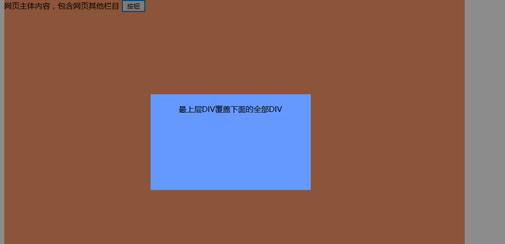

# 前言
后端工程师也有一个前台梦  哈哈!!!!

# div覆盖
`目的`：通过点击按钮，弹出小方框背景为灰色，效果如下：

再次点击灰色，样式恢复
源码如下:
``` html
<html>

	<head>
		<meta charset="utf-8" />
		<style>
			.main {
				width: 960px;
				height: 800px;
				background-color: #FF9966;
				margin: 0px auto;
			}
			
			.mask {
				z-index: 900;
				/*以下设置覆盖整个窗口*/
				position: fixed;
				left: 0px;
				top: 0px;
				width: 100%;
				height: 100%;
				background: #000;/*灰色背景*/
				opacity: 0.45;/*透明度*/
			}
			
			.opendiv {
				z-index: 920;
				/*设置div位置*/
				position: absolute;
				left: 50%;
				top: 50%;
				margin-left: -175px;
				margin-top: -125px;
				width: 334px;
				height: 180px;
				background-color: #6699FF;
				text-align: center;
				padding-top: 20px;
			}
		</style>

	</head>

	<body topmargin="0">

		<div class="main">
			网页主体内容，包含网页其他栏目
			<button onclick="on()">按钮</button>
		</div>
		<!--蒙板-->
		<div class="mask" style="display: none;" onclick="off()"></div>
		<div class="opendiv" style="display: none;">
			最上层DIV覆盖下面的全部DIV
		</div>
	</body>
	
	<script>
		function on(){
    		//点击后，将div样式display设置为inline-block
			var mask = document.getElementsByClassName("mask")[0];
			var opendiv = document.getElementsByClassName("opendiv")[0];
			if(mask.style.display=="none"){
				mask.style.display="inline-block";
				opendiv.style.display="inline-block";
			}
		}
		function off(){
    		//点击后，将div样式display设置为none
			var mask = document.getElementsByClassName("mask")[0];
			var opendiv = document.getElementsByClassName("opendiv")[0];
			mask.style.display="none";
			opendiv.style.display="none";
		}
		
	</script>

</html>
```
解释见代码！！
> 详情请参考[DIV块的覆盖，DIV层遮盖其他DIV](http://www.91ctc.com/article/article-129.html)