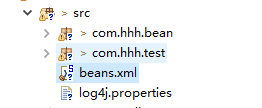
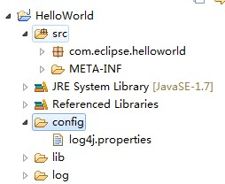

# log4J的安装
进入官网下载即可[http://logging.apache.org/log4j/1.2/download.html](http://logging.apache.org/log4j/1.2/download.html)

# log4J的配置及解释
## 示例
``` properties
# Define the root logger with appender file
log4j.rootLogger = DEBUG, FILE

# Define the file appender
log4j.appender.FILE=org.apache.log4j.FileAppender
# Set the name of the file
log4j.appender.FILE.File=C:\log.out

# Set the immediate flush to true (default)
log4j.appender.FILE.ImmediateFlush=true

# Set the threshold to debug mode
log4j.appender.FILE.Threshold=debug

# Set the append to false, overwrite
log4j.appender.FILE.Append=false

# Define the layout for file appender
log4j.appender.FILE.layout=org.apache.log4j.PatternLayout
log4j.appender.FILE.layout.conversionPattern=%m%n
```
- 根日志记录器(logger)的级别定义为DEBUG并连接附加器命名为FILE
- 附加器(appender)File是定义为org.apache.log4j.FileAppender并写入到一个名为“log.out”位于日志log目录下
- 定义的布局模式是%m%n，这意味着每打印日志消息之后，将加上一个换行符
> 注意:<font color='#4ACC60'>log4j支持UNIX风格的变量替换，如 ${variableName}.</font>

## 调试级别
使用DEBUG两个追加程序。所有可能的选项有：
- TRACE
- DEBUG
- INFO
- WARN
- ERROR
- FATAL
- ALL

## Appenders
> Apache的log4j提供`Appender`对象<font color='#FFAA25'>**主要负责打印日志消息到不同的目的地**</font>，如控制台，文件，sockets，NT事件日志等等。
> 每个`Appender`对象具有与之相关联的不同的属性，并且这些属性表明对象的行为

| 属性        |        描述      | 
|:-------------:| ------------- |
| layout      |Appender使用布局Layout 对象和与之相关的格式化的日志记录信息转换模式 |
| target     | 目标可以是一个控制台，一个文件，或根据附加器的另一个项目 |
| level | 级别是必需的，以控制日志消息的过滤 |
| threshold | Appender可以有与之独立的记录器级别相关联的级别阈值水平。Appender忽略具有级别低于阈级别的任何日志消息|
| filter | Filter 对象可以分析超出级别的匹配记录信息，并决定是否记录的请求应该由一个特定 Appender 或忽略处理 |

## Layout
我们使用的PatternLayout 使用 appender。所有可能的选项有：
- DateLayout
- HTMLLayout
- [PatternLayout](http://www.yiibai.com/log4j/log4j_patternlayout.html)
- [SimpleLayout](http://www.yiibai.com/log4j/log4j_htmllayout.html)
- XMLLayout
> 使用HTMLLayout和XMLLayout，可以在HTML和XML格式和生成日志。

## 参考链接
- `properties`相关配置详情请看[log4j配置](http://www.yiibai.com/log4j/log4j_configuration.html)
- `xml`相关配置详情请看[springmvc+log4j操作日志记录,详细配置 ](http://www.cnblogs.com/v-weiwang/p/4814050.html)

# log4J配置文件位置
## 默认加载
> log4j启动时，<font color='#CF59E0'>默认会寻找source folder下的log4j.xml配置文件，**若没有，会寻找log4j.properties文件。**</font>然后加载配置。配置文件放置位置正确，不用在程序中手动加载log4j配置文件。



## 手动加载配置文件
> 可以通过`PropertyConfigurator.configure("url") `来手动加载配置文件，示例如下:


> 相应代码如下:`PropertyConfigurator.configure("config/log4j.properties");`

## log4J报错
> 如果上述方法报以下错:

``` java
log4j:ERROR Could not read configuration file [log4j.properties].
java.io.FileNotFoundException: log4j.properties (系统找不到指定的文件。)
 at java.io.FileInputStream.open(Native Method)
 at java.io.FileInputStream.<init>(FileInputStream.java:106)
 at java.io.FileInputStream.<init>(FileInputStream.java:66)
 at org.apache.log4j.PropertyConfigurator.doConfigure(PropertyConfigurator.java:306)
 at org.apache.log4j.PropertyConfigurator.configure(PropertyConfigurator.java:324)
 at snmp.GetSnmpInfo.<clinit>(GetSnmpInfo.java:32)
log4j:ERROR Ignoring configuration file [log4j.properties].
```
- 解决方案:
    - `方案1:`将log4j.properties 这个文件从src的根目录 转移到 项目的根目录下面，即可~~~；
    - `方案2:`添加以下代码
``` java
// 获得当前目录路径
        String filePath = this.getClass().getResource("/").getPath();
        // 找到log4j.properties配置文件所在的目录(已经创建好)
        filePath = filePath.substring(1).replace("bin", "src");
        // 获得日志类loger的实例
        loger = Logger.getLogger(this.getClass());
        // loger所需的配置文件路径
        PropertyConfigurator.configure(filePath + "log4j.properties");
```
## 参考链接
详情请看[log4j配置文件位置详解](http://blog.csdn.net/lifuxiangcaohui/article/details/11042375)
详情请看[log4j:ERROR Could not read configuration file [log4j.properties]. ](http://www.cnblogs.com/tv151579/archive/2013/01/20/2868912.html)

# 扩展内容
[log4j日志记录到文件](http://www.yiibai.com/log4j/log4j_logging_files.html)
[log4j日志记录到数据库](http://www.yiibai.com/log4j/log4j_logging_database.html)
