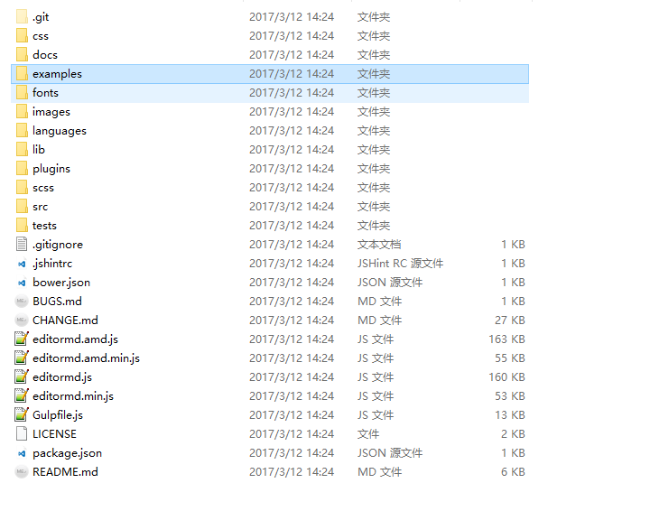
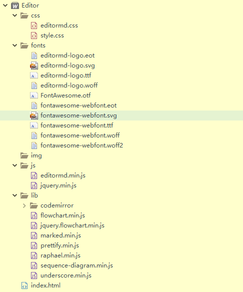
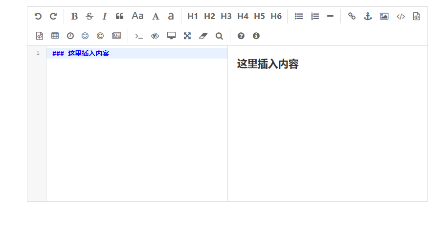
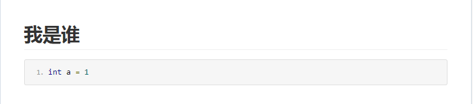

# 前言
> 博客既然能用markdown编写，能否直接在网上编写呢，答案当然是可以，去github搜索一下即可找到[editor.md](https://github.com/pandao/editor.md)，国人开发哦！！

# 使用方法
## 下载后的目录如图

> 在examples文件夹中有一个简单的示例simple.html，可以在浏览器里打开，并查看源代码;

- 可得原代码为:
``` html
<!DOCTYPE html>
<html lang="zh">

	<head>
		<meta charset="utf-8" />
		<title>Simple example - Editor.md examples</title>
		<link rel="stylesheet" href="css/style.css" />
		<link rel="stylesheet" href="css/editormd.css" />
	</head>

	<body>
		<div id="layout">
			<header>
				<h1>Simple example</h1>
			</header>
			<div id="test-editormd">
				<textarea style="display:none;">### 这里插入内容</textarea>
			</div>
		</div>
		<script src="js/jquery.min.js"></script>
		<script src="js/editormd.min.js"></script>
		<script type="text/javascript">
			var testEditor;

			$(function() {
				testEditor = editormd("test-editormd", {
    				//调整宽度
					width: "60%",
					//调整高度
					height: 400,
					syncScrolling: "single",
					path: "./lib/"
				});
			});
		</script>
	</body>

</html>
```
> 这里把目录改了下：


- `lib`：为根目录下的文件，直接复制即可
- `css`：`editormd.js`在根目录`css`文件中，`style.css`在`examples/css`中
- `js`：`editormd.min.js`在根目录下，`jquery.min.js`在`examples\js`中
- `fonts`：为根目录下的文件，直接复制即可

## 最后效果图


# 注意
> <font color='#FF3A8F'>当文件放在**display:none的div下会导致格式(样式)出错**</font>

# 如何在页面中显示
## 提交html代码
> html代码如下:
``` html
<input type="text" name="pDescription" class="editormd-html-textarea"></input>
```
> js代码如下:

``` js
var ohtml=$('.editormd-html-textarea'), opreview=$('.editormd-preview').clone(); 
 ohtml.val(opreview.html());
```
> 最后form表单提交，后台拿到pDescription的值即可

## 页面显示
> 引入前文(上面使用方法中有讲到)css样式即可显示！！
> 效果如图

