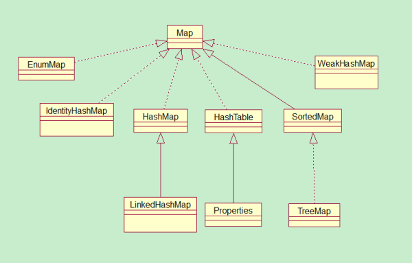

# 前言
<font color='#CD5555'>**由于这几天看了些有关map的知识点，面试可能会被问到，所以来总结总结！！**</font>

# Map介绍


| Map的实现 | 解释|
| --- | :---: |
|HashMap |Map基于散列表的实现(取代了HashTable，下文将介绍),插入和查询"键值对"的开销是固定的，可以通过构造器设置容量和负载因子，以调整容器的性能|
|LinkedHashMap|类似于HashMap,但是迭代遍历它时，取得"键值对"的顺序是插入次序、或者是最近最少使用(LRU)的次序。只比HashMap慢一点；而在迭代访问时速度反而更快、因为它使用链表维护内部次序|
|TreeMap|基于红黑树的实现。查看"键"或"键值对"时，它们会被排序(次序由Comparable或Comparator决定)。TreeMap的特点在于，所得到的的结果是经过排序的。TreeMap是唯一的带有subMap()方法的Map，他可以返回一个子树|
|WeakHashMap|弱键映射，允许释放映射所指向的对象；这是为解决某类特殊问题而设计的。如果映射之外没有引用指向某个"键"，则此"键"可以被垃圾收集器回收|
|ConcurrentHashMap|一种线程安全的Map，它不涉及同步加锁。|
|IDentityHashMap|使用==代替equals对"键"进行比较的散列映射。专门解决特殊问题二设计的|

## HashMap
- **HashMap的存储结构**

- **HashMap有四个构造方法，方法中有两个很重要的参数：初始容量和加载因子**
    - 这两个参数是影响HashMap性能的重要参数，其中容量表示哈希表中槽的数量（即哈希数组的长度），**<font color='#0077BB'>初始容量</font>是创建哈希表时的容量（默认为16），<font color='#0077BB'>加载因子</font>是哈希表当前key的数量和容量的比值，<font color='#CD5555'>当哈希表中的条目数超出了加载因子与当前容量的乘积时，则要对该哈希表提前进行 resize 操作（即扩容）。</font>**如果加载因子越大，对空间的利用更充分，但是查找效率会降低（链表长度会越来越长）；如果加载因子太小，那么表中的数据将过于稀疏（很多空间还没用，就开始扩容了），严重浪费。
    - JDK开发者规定的默认加载因子为0.75，因为这是一个比较理想的值。另外，无论指定初始容量为多少，构造方法都会将实际容量设为不小于指定容量的2的幂次方，且最大值不能超过2的30次方

- **重点分析HashMap中用的最多的两个方法put和get的源码**
    - get方法源码
    ``` java
    // 获取key对应的value
    public V get(Object key) {
        if (key == null)
            return getForNullKey();
        // 获取key的hash值
        int hash = hash(key.hashCode());
        // 在“该hash值对应的链表”上查找“键值等于key”的元素
        for (Entry<K, V> e = table[indexFor(hash, table.length)]; e != null; e = e.next) {
            Object k;
            // 判断key是否相同
            if (e.hash == hash && ((k = e.key) == key || key.equals(k)))
                return e.value;
        }
        // 没找到则返回null
        return null;
    }

    // 获取“key为null”的元素的值，HashMap将“key为null”的元素存储在table[0]位置，但不一定是该链表的第一个位置！
    private V getForNullKey() {
        for (Entry<K, V> e = table[0]; e != null; e = e.next) {
            if (e.key == null)
                return e.value;
        }
        return null;
    }
    ```
    首先，<font color='#CD5555'>**如果key为null，则直接从哈希表的第一个位置table[0]对应的链表上查找。**</font>记住，key为null的键值对永远都放在以table[0]为头结点的链表中，当然不一定是存放在头结点table[0]中。<font color='#CD5555'>**如果key不为null，则先求的key的hash值，根据hash值找到在table中的索引，在该索引对应的单链表中查找是否有键值对的key与目标key相等，有就返回对应的value，没有则返回null。**</font>
    - put方法源码
    ``` java
    // 将“key-value”添加到HashMap中
    public V put(K key, V value) {
        // 若“key为null”，则将该键值对添加到table[0]中。
        if (key == null)
            return putForNullKey(value);
        // 若“key不为null”，则计算该key的哈希值，然后将其添加到该哈希值对应的链表中。
        int hash = hash(key.hashCode());
        int i = indexFor(hash, table.length);
        for (Entry<K, V> e = table[i]; e != null; e = e.next) {
            Object k;
            // 若“该key”对应的键值对已经存在，则用新的value取代旧的value。然后退出！
            if (e.hash == hash && ((k = e.key) == key || key.equals(k))) {
                V oldValue = e.value;
                e.value = value;
                e.recordAccess(this);
                return oldValue;
            }
        }

        // 若“该key”对应的键值对不存在，则将“key-value”添加到table中
        modCount++;
        // 将key-value添加到table[i]处
        addEntry(hash, key, value, i);
        return null;
    }
    ```
    如果key为null，则将其添加到table[0]对应的链表中，如果key不为null，则同样先求出key的hash值，根据hash值得出在table中的索引，而后遍历对应的单链表，<font color='#CD5555'>**如果单链表中存在与目标key相等的键值对，则将新的value覆盖旧的value，且将旧的value返回，如果找不到与目标key相等的键值对，或者该单链表为空，则将该键值对插入到单链表的头结点位置（每次新插入的节点都是放在头结点的位置）**</font>，该操作是有addEntry方法实现的，它的源码如下：
    - view code
    ``` java
    // 新增Entry。将“key-value”插入指定位置，bucketIndex是位置索引。
    void addEntry(int hash, K key, V value, int bucketIndex) {
        // 保存“bucketIndex”位置的值到“e”中
        Entry<K, V> e = table[bucketIndex];
        // 设置“bucketIndex”位置的元素为“新Entry”，
        // 设置“e”为“新Entry的下一个节点”
        table[bucketIndex] = new Entry<K, V>(hash, key, value, e);
        // 若HashMap的实际大小 不小于 “阈值”，则调整HashMap的大小
        if (size++ >= threshold)
            resize(2 * table.length);
    }
    ```
    注意这里倒数第三行的构造方法，**将key-value键值对赋给table[bucketIndex]，并将其next指向元素e，这便将key-value放到了头结点中，并将之前的头结点接在了它的后面。**该方法也说明，每次put键值对的时候，总是将新的该键值对放在table[bucketIndex]处（即头结点处）。两外注意最后两行代码，**每次加入键值对时，都要判断当前已用的槽的数目是否大于等于阀值（容量*加载因子），如果大于等于，则进行扩容，将容量扩为原来容量的2倍。**
    
- **重点来分析下求hash值和索引值的方法，这两个方法便是HashMap设计的最为核心的部分，二者结合能保证哈希表中的元素尽可能均匀地散列**
    - 由hash值找到对应索引的方法如下
    ``` java
    static int indexFor(int h, int length) {
        return h & (length-1);
     }
    ```
    因为容量初始还是设定都会转化为2的幂次。故可以使用高效的位与运算替代模运算。下面会解释原因。
    - 计算hash值的方法如下
    ``` java
    static int hash(int h) {
            h ^= (h >>> 20) ^ (h >>> 12);
            return h ^ (h >>> 7) ^ (h >>> 4);
        }
    ```
    JDK 的 HashMap 使用了一个 hash 方法对hash值使用位的操作，使hash值的计算效率很高。为什么这样做？<font color='#00C54A'>主要是因为如果直接使用hashcode值，那么这是一个int值（8个16进制数，共32位），int值的范围正负21亿多，但是hash表没有那么长，一般比如初始16，自然散列地址需要对hash表长度取模运算，得到的余数才是地址下标。假设某个key的hashcode是0AAA0000，hash数组长默认16，如果不经过hash函数处理，该键值对会被存放在hash数组中下标为0处，因为0AAA0000 & (16-1) = 0。过了一会儿又存储另外一个键值对，其key的hashcode是0BBB0000，得到数组下标依然是0，这就说明这是个实现得很差的hash算法，因为hashcode的1位全集中在前16位了，导致算出来的数组下标一直是0。于是明明key相差很大的键值对，却存放在了同一个链表里，导致以后查询起来比较慢（蜕化为了顺序查找）。</font>故JDK的设计者使用hash函数的若干次的移位、异或操作，把hashcode的“1位”变得“松散”，非常巧妙。
    
- **关于扩容。看hashmap的扩容方法，resize方法**
``` java
// 重新调整HashMap的大小，newCapacity是调整后的单位
    void resize(int newCapacity) {
        Entry[] oldTable = table;
        int oldCapacity = oldTable.length;
        if (oldCapacity == MAXIMUM_CAPACITY) {
            threshold = Integer.MAX_VALUE;
            return;
        }

        // 新建一个HashMap，将“旧HashMap”的全部元素添加到“新HashMap”中，
        // 然后，将“新HashMap”赋值给“旧HashMap”。
        Entry[] newTable = new Entry[newCapacity];
        transfer(newTable);
        table = newTable;
        threshold = (int) (newCapacity * loadFactor);
    }
```
很明显，是从新建了一个HashMap的底层数组，长度为原来的两倍，而后调用transfer方法，将旧HashMap的全部元素添加到新的HashMap中（要重新计算元素在新的数组中的索引位置）。transfer方法的源码如下:
``` java
// 将HashMap中的全部元素都添加到newTable中
    void transfer(Entry[] newTable) {
        Entry[] src = table;
        int newCapacity = newTable.length;
        for (int j = 0; j < src.length; j++) {
            Entry<K, V> e = src[j];
            if (e != null) {
                src[j] = null;
                do {
                    Entry<K, V> next = e.next;
                    int i = indexFor(e.hash, newCapacity);
                    e.next = newTable[i];
                    newTable[i] = e;
                    e = next;
                } while (e != null);
            }
        }
    }
```
很明显，扩容是一个相当耗时的操作，因为它需要重新计算这些元素在新的数组中的位置并进行复制处理。因此，我们在用HashMap时，最好能提前预估下HashMap中元素的个数，这样有助于提高HashMap的性能。

### 更详细内容
[HashMap 和 HashTable 源码学习和面试总结](https://zhuanlan.zhihu.com/p/24338517)

## LinkedHashMap
- LinkedHashMap 是 HashMap 的一个子类，它保留插入的顺序，如果需要输出的顺序和输入时的相同，那么就选用 LinkedHashMap。
- LinkedHashMap 是 Map 接口的哈希表和链接列表实现，具有可预知的迭代顺序。此实现提供所有可选的映射操作，并允许使用 null 值和 null 键。此类不保证映射的顺序，特别是它不保证该顺序恒久不变。
- LinkedHashMap 实现与 HashMap 的不同之处在于，LinkedHashMap 维护着一个运行于所有条目的双重链接列表。此链接列表定义了迭代顺序，该迭代顺序可以是插入顺序或者是访问顺序。
- 注意，此实现不是同步的。如果多个线程同时访问链接的哈希映射，而其中至少一个线程从结构上修改了该映射，则它必须保持外部同步。

根据链表中元素的顺序可以分为：**按插入顺序的链表，和按访问顺序(调用 get 方法)的链表。默认是按插入顺序排序，如果指定按访问顺序排序，那么调用get方法后，会将这次访问的元素移至链表尾部，不断访问可以形成按访问顺序排序的链表**

### 详情参考
[LinkedHashMap 的实现原理](http://wiki.jikexueyuan.com/project/java-collection/linkedhashmap.html)

## TreeMap
